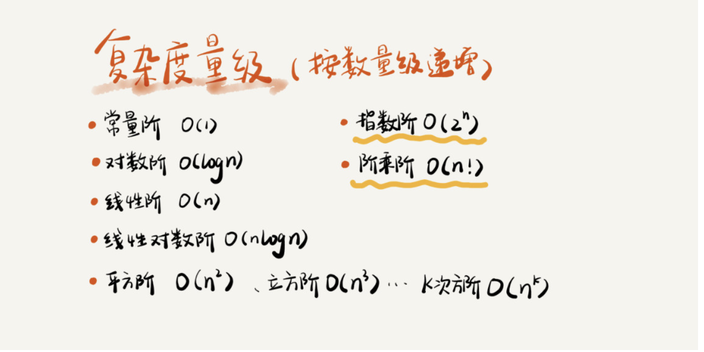
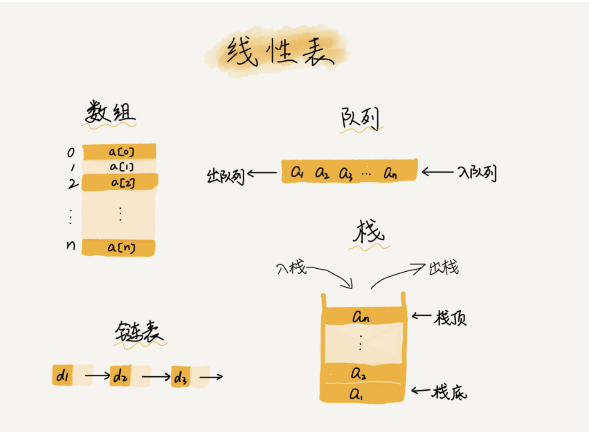
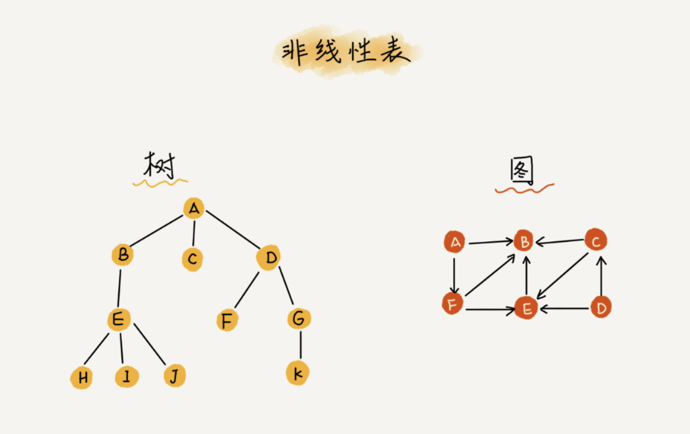
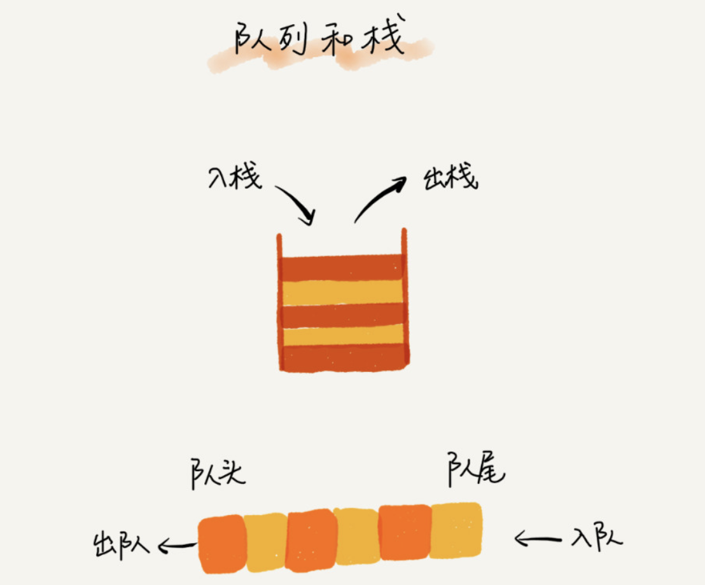
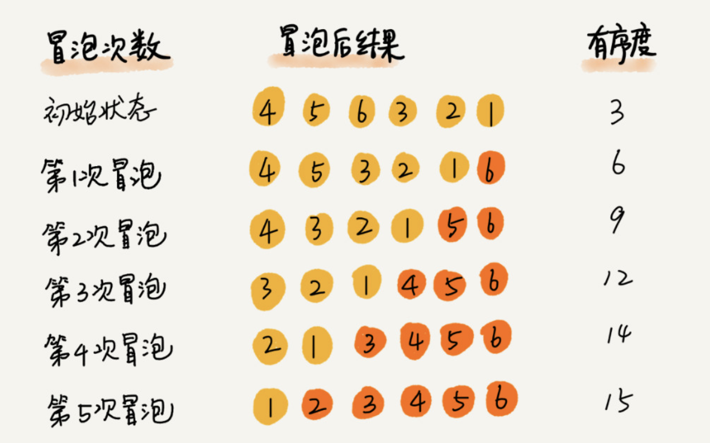
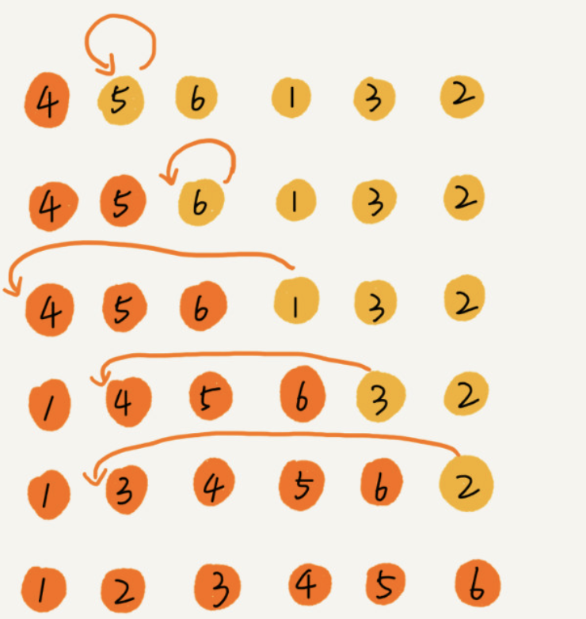
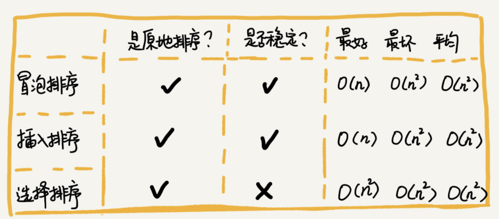
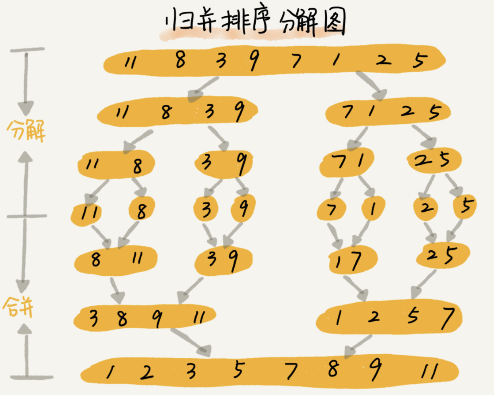
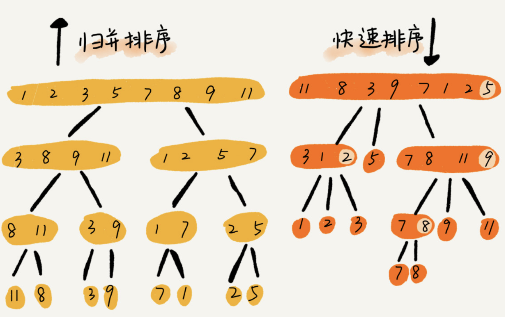
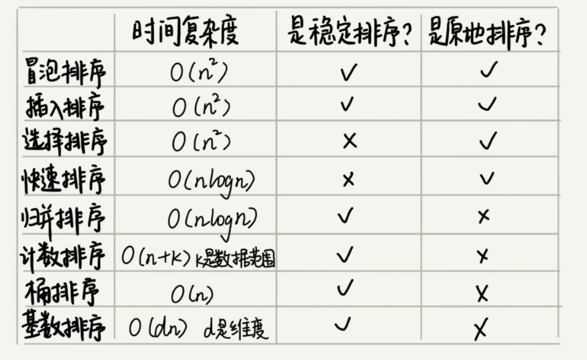

## 时间复杂度

时间复杂度的全称是**渐进时间复杂度**，**表示算法的执行时间与数据规模之间的增长关系**。

1. **只关注循环执行次数最多的一段代码**
2. **加法法则：总复杂度等于量级最大的那段代码的复杂度**
3. **乘法法则：嵌套代码的复杂度等于嵌套内外代码复杂度的乘积**



### o(1)

一般情况下，只要算法中不存在循环语句、递归语句，即使有成千上万行的代码，其时间复杂度也是Ο(1)。

```java
 int i=8;
        int j=6;
        int sum=i+j;
        O(1）
```

### O(logn)、O(nlogn)

对数阶时间复杂度非常常见，同时也是最难分析的一种时间复杂度

```java
i=1;
        while(i<=n){
        i=i*3;
        }
        O(log3n)->我们忽略对数的“底”，统一表示为 O(logn)。
```

### O(m+n)、O(m\*n)

代码的复杂度**由两个数据的规模**来决定

```java
int cal(int m,int n){
        int sum_1=0;
        int i=1;
        for(;i<m; ++i){
        sum_1=sum_1+i;
        }

        int sum_2=0;
        int j=1;
        for(;j<n; ++j){
        sum_2=sum_2+j;
        }

        return sum_1+sum_2;
        }

        O(m+n)
```

## 空间复杂度

空间复杂度全称就是**渐进空间复杂度**（asymptotic space complexity），**表示算法的存储空间与数据规模之间的增长关系**。

```java
void print(int n){
        int i=0;
        int[]a=new int[n];
        for(i;i<n; ++i){
        a[i]=i*i;
        }

        for(i=n-1;i>=0;--i){
        print out a[i]
        }
        }


```

空间复杂度就是 O(1)、O(n)、O(n2 )，像 O(logn)、O(nlogn) 这样的对数阶复杂度平时都用不到。

## 数组

**一种线性表数据结构。它用一组连续的内存空间，来存储一组具有相同类型的数据。**





a[i]_address = base_address + i * data_type_size;

## 链表

链表通过指针将一组零散的内存块串联在一起。

单链表的尾结点指针指向空地址，表示这就是最后的结点了。而`循环链表`的尾结点指针是指向链表的头结点

- 技巧一：理解指针或引用的含义

```text
将某个变量赋值给指针，实际上就是将这个变量的地址赋值给指针，或者反过来说，指针中存储了这个变量的内存地址，指向了这个变量，通过指针就能找到这个变量。


```

- 技巧二：警惕指针丢失和内存泄漏

- 技巧三：利用哨兵简化实现难度

针对链表的插入、删除操作，需要对插入第一个结点和删除最后一个结点的情况进行特殊处理

- 技巧四：重点留意边界条件处理

```text

    如果链表为空时，代码是否能正常工作？
    如果链表只包含一个结点时，代码是否能正常工作？
    如果链表只包含两个结点时，代码是否能正常工作？
    代码逻辑在处理头结点和尾结点的时候，是否能正常工作？
```

- 技巧五：举例画图，辅助思考

- 技巧六：多写多练，没有捷径

LeetCode 206，141，21，19，876

单链表反转

链表中环的检测

两个有序的链表合并

删除链表倒数第 n 个结点

求链表的中间结点

## 栈

**后进者先出，先进者后出，这就是典型的“栈”结构。**

## 队列

**先进者先出，这就是典型的“\**\*\*队列\*\**\*”**。

最基本的操作也是两个：**入队 enqueue()**，放一个数据到队列尾部；**出队 dequeue()**，从队列头部取一个元素。



**确定好队空和队满的判定条件**

```java
public class CircularQueue {

    // 数组：items，数组大小：n

    private String[] items;

    private int n = 0;

    // head 表示队头下标，tail 表示队尾下标

    private int head = 0;

    private int tail = 0;


    // 申请一个大小为 capacity 的数组

    public CircularQueue(int capacity) {
        items = new String[capacity];
        n = capacity;

    }


    // 入队

    public boolean enqueue(String item) {

        // 队列满了
        if ((tail + 1) % n == head) return false;

        items[tail] = item;

        tail = (tail + 1) % n;

        return true;

    }


    // 出队
    public String dequeue() {

        // 如果 head == tail 表示队列为空

        if (head == tail) return null;

        String ret = items[head];

        head = (head + 1) % n;

        return ret;

    }

}
```

## 递归

**写递归代码的关键就是找到如何将大问题分解为小问题的规律，并且基于此写出递推公式，然后再推敲终止条件，最后将递推公式和终止条件翻译成代码**

1. 一个问题的解可以分解为几个子问题的解
2. 这个问题与分解之后的子问题，除了数据规模不同，求解思路完全一样
3. 存在递归终止条件

注意项：

- 递归代码要警惕堆栈溢出(限制调用深度)
- 递归代码要警惕重复计算(散列表)
-

## 冒泡

**逆序度 = 满有序度 - 有序度**

**逆序度，也就是n\*(n-1)/2–初始有序度**



## 插入排序

O(1)   原地排序算法 稳定排序算法



```java
// 插入排序，a 表示数组，n 表示数组大小

public void insertionSort(int[] a, int n) {

  if (n <= 1) return;

 

  for (int i = 1; i < n; ++i) {

    int value = a[i];

    int j = i - 1;

    // 查找插入的位置
    for (; j >= 0; --j) {

      if (a[j] > value) {

        a[j+1] = a[j];  // 数据移动

      } else {

        break;

      }
    }
    a[j+1] = value; // 插入数据

  }

}
```

## 选择排序

选择排序每次会从未排序区间中找到最小的元素，将其放到已排序区间的末尾。

O(1)   不稳定排序 原地排序算法

冒泡排序和插入排序，选择排序就稍微逊色了。



这3个相对好的是插入排序，适合小规模数据的排

## 归并

```
递推公式：

merge_sort(p…r) = merge(merge_sort(p…q), merge_sort(q+1…r))

 

终止条件：

p >= r 不用再继续分解
```



```java
// 归并排序算法, A 是数组，n 表示数组大小

merge_sort(A, n) {

  merge_sort_c(A, 0, n-1)

}

 

// 递归调用函数

merge_sort_c(A, p, r) {

  // 递归终止条件

  if p >= r  then return

 

  // 取 p 到 r 之间的中间位置 q

  q = (p+r) / 2
  // 分治递归

  merge_sort_c(A, p, q)

  merge_sort_c(A, q+1, r)

  // 将 A[p...q] 和 A[q+1...r] 合并为 A[p...r]

  merge(A[p...r], A[p...q], A[q+1...r])

}


```

非原地排序



## 桶排序（Bucket sort）

**线性排序**: 桶排序、计数排序、基数排序

O(n*log(n/m))  = o(n)

桶排序对要排序数据的要求是非常苛刻的,桶排序比较适合用在外部排序中;

计数排序实是桶排序的一种特殊情况;

```text
计数排序只能用在数据范围不大的场景中，如果数据范围 k 比要排序的数据 n 大很多，就不适合用计数排序了。而且，计数排序只能给非负整数排序，如果要排序的数据是其他类型的，要将其在不改变相对大小的情况下，转化为非负整数。
```

```java
// 计数排序，a 是数组，n 是数组大小。假设数组中存储的都是非负整数。

public void countingSort(int[] a, int n) {

  if (n <= 1) return;

 

  // 查找数组中数据的范围

  int max = a[0];

  for (int i = 1; i < n; ++i) {

    if (max < a[i]) {

      max = a[i];

    }

  }

 

  int[] c = new int[max + 1]; // 申请一个计数数组 c，下标大小 [0,max]

  for (int i = 0; i <= max; ++i) {

    c[i] = 0;

  }

 

  // 计算每个元素的个数，放入 c 中

  for (int i = 0; i < n; ++i) {

    c[a[i]]++;

  }

 

  // 依次累加

  for (int i = 1; i <= max; ++i) {

    c[i] = c[i-1] + c[i];

  }

 

  // 临时数组 r，存储排序之后的结果

  int[] r = new int[n];

  // 计算排序的关键步骤，有点难理解

  for (int i = n - 1; i >= 0; --i) {

    int index = c[a[i]]-1;

    r[index] = a[i];

    c[a[i]]--;

  }

 

  // 将结果拷贝给 a 数组

  for (int i = 0; i < n; ++i) {

    a[i] = r[i];

  }

}
```

基数排序(Radix sort)：

基数排序对要排序的数据是有要求的，需要可以分割出独立的“位”来比较，而且位之间有递进的关系，如果 a 数据的高位比 b
数据大，那剩下的低位就不用比较了。除此之外，每一位的数据范围不能太大，要可以用线性排序算法来排序，否则，基数排序的时间复杂度就无法做到 O(n) 了。




