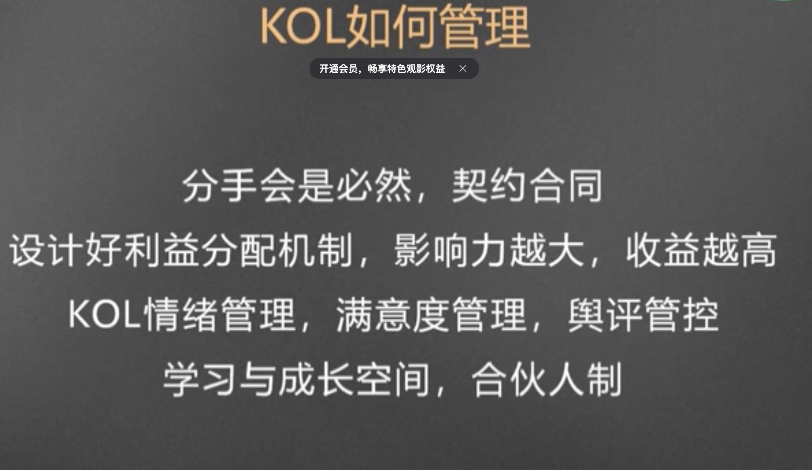

内容符合社会主义核心价值观

违法信息

## 一、IP孵化：赛道选择

平台趋势、商业价值

巨量算数查看统计数据

## 二、IP孵化：人设与角色

1、挖掘人性和心理原型，寻找情感共鸣。 2、用讲故事的方式，建立认同感

## 三、IP孵化：内容快速迭代

1、搭建最小单元团队。编导+演员

2、验证适合的内容方向

## 四、IP孵化：精细化运营

1、增加用户粘性、提升忠诚度与转化

2、先单平台突破、在跨平台运营

### 短视频思维：

算法、用户、数据

网络的敏感度

